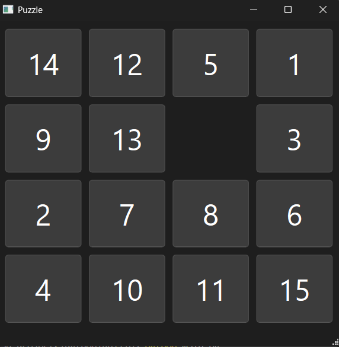
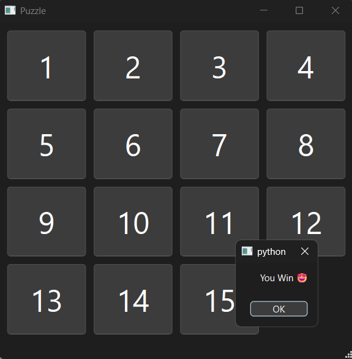

# 🧩 15 Puzzle Game  

  
  

The **15 Puzzle Game** is a classic sliding puzzle built with **Python (v3.12)** and **PySide6 (Qt for Python)**.  
Your goal is to arrange the numbers from **1 to 15** in the correct order by sliding the tiles into the empty space.  
You can play using **mouse clicks** or **arrow keys** on your keyboard.  

---

## ✨ Features  
- 🔢 Randomly generated **4×4 board** (non-repeating numbers)  
- 🖱️ Move tiles by **clicking** or using **arrow keys**  
- 🏆 Automatic **win detection** with a victory message  
- 🎮 Smooth and responsive tile movement  
- 🧠 Simple but elegant **object-oriented logic**  
- 🪟 Built with **PySide6 (Qt Widgets UI)**  

---

## 🎯 Gameplay  
Slide the numbered tiles to arrange them in order from **1 to 15**.  
Only tiles adjacent to the empty space can move.  
When all tiles are in the correct order, you win!  

---

## 🕹️ Controls  
| Action | Key |
|--------|-----|
| Move Up | ⬆️ Arrow Key |
| Move Down | ⬇️ Arrow Key |
| Move Left | ⬅️ Arrow Key |
| Move Right | ➡️ Arrow Key |
| Move by Mouse | 🖱️ Click a tile next to the empty space |

---

## 📌 How to Run
1. Install dependencies:
   ```bash
   pip install PySide6
2. Run the game:
    ```bash
    python main.py

## 📅 Project Status

Current version: v1.0 (Basic functional version)
Future plans:

- ⏱️ Add timer

- 🔢 Add move counter

- 🔁 Add restart/reset button

## 👨‍💻 Author

Created with ❤️ by Sajjad Saljoghi